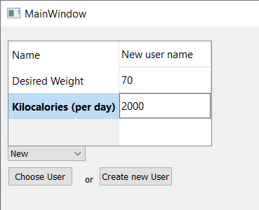
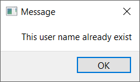
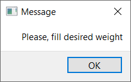
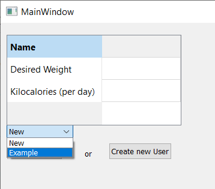

*********************
Выбор пользователя
*********************

При запуске приложения пользователю предлагается выбрать аккаунт, существует 2 возможности:

Создание нового пользователя
============================

Для этого нужно заполнить все поля таблицы в левом верхнем углу окна и нажать кнопку "Create new user".

Если пользователь с таким именем существует, приложение выдаст информацию об ошибке:

Так же ошибка может возникнуть, если какое-либо поле при создании пользователя не было заполнено:

Выбор уже существуещего пользователя
====================================

Если пользователь уже пользовался приложением, он может выбрать свой аккаунт и нажать кнопку "Choose user".

Если пользователь не был выбран (остался "New"), а кнопка нажата, пользователь опять получит информацию об ошибке.
   