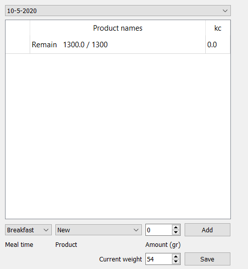
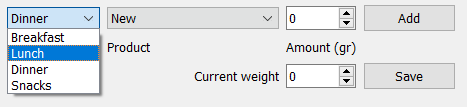
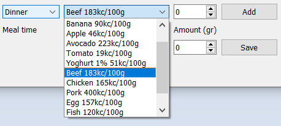
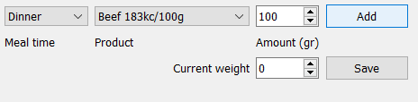
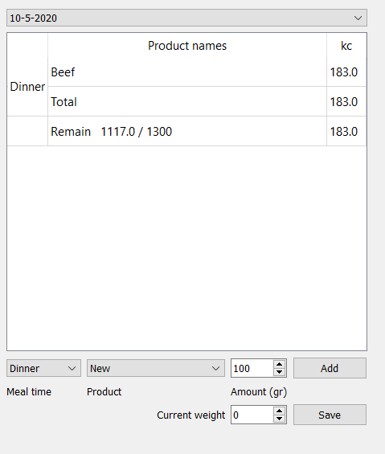
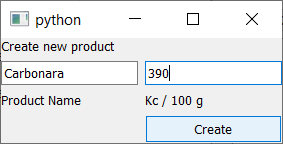
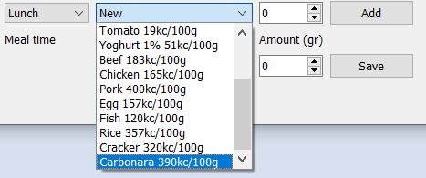
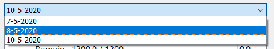
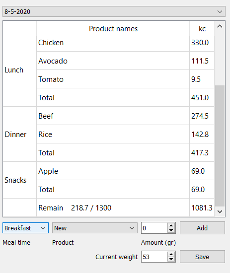
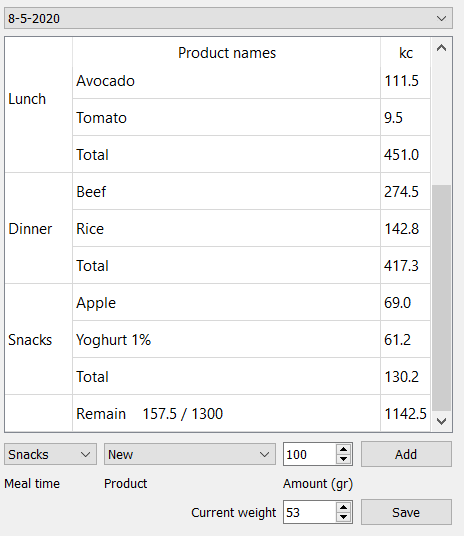

*********************
Таблица с информацией
*********************

Сразу после выбора/создания пользователя, загружаются поля с информацией по текущему дню и функционалом по добавлению новой информации.
По умолчанию день выбран как текущий.

Добавление продукта в текущий день
==================================

Для того, чтобы добавить новый продукт, пользователь может выбрать время приёма пищи:

Затем выбрать продукт из уже существующих в базе данных:

Ввести употреблённое количество и нажать кнопку "Add":

После чего таблица с информацией автоматически обновится:

Создание нового продукта
========================

Если нужного продукта или блюда не существует в базе, пользователь может его создать. Для этого нужно выбрать продукт как "New" и нажать кнопку "Add". В результате чего появится окно, куда можно ввести данные о новом продукте.

После того, как пользователь ввёл информацию о новом продукте и нажал на кнопку "Create", этот продукт добавляется в список:

Информация о предыдущих днях
============================

Если пользователь уже пользовался приложением, у него есть возможность просмотреть информацию за предыдущий день, выбрав интересующий в верхнем правом углу:

Как только пользователь нажмёт на интересующий день, поля обновятся в соответсвии с имеющейся информацией по этому дню (в том числе и с весом по этому дню).

Пользователь может добавить в этот день новый продукт (или изменить вес).

   